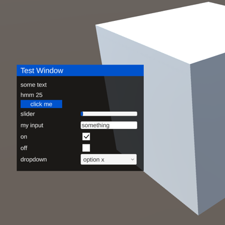

# GWindowsUI
Create ui windows in unity!



1. Download the GWindowsUI.unitypackage
2. Open a unity project
3. Double click on GWindowsUI.unitypackage and import it
4. Drag the GWindowSystem prefab (in GWindowsUI folder) into the scene
5. Add these lines of code to a script in the scene:
```
  private void Start() {
    var window = Gulcar.Window.Create("Window Title");
    window.AddText("hello world");
    window.AddButton("click me!").onClick.AddListener(() => Debug.Log("clicked!"));
  }
```
List of methods that you can call on a window:
- AddText(string text)
- AddButton(string text)
- AddSlider(string text, float min, float max, float initial)
- AddInput(string text, string initialInput)
- AddToggle(string text, bool toggled)
- AddDropdown(string text, List<string> options, int initialSelected)
- ForceUpdateHeight()

All methods that add ui elements to a window return a reference to that element.
